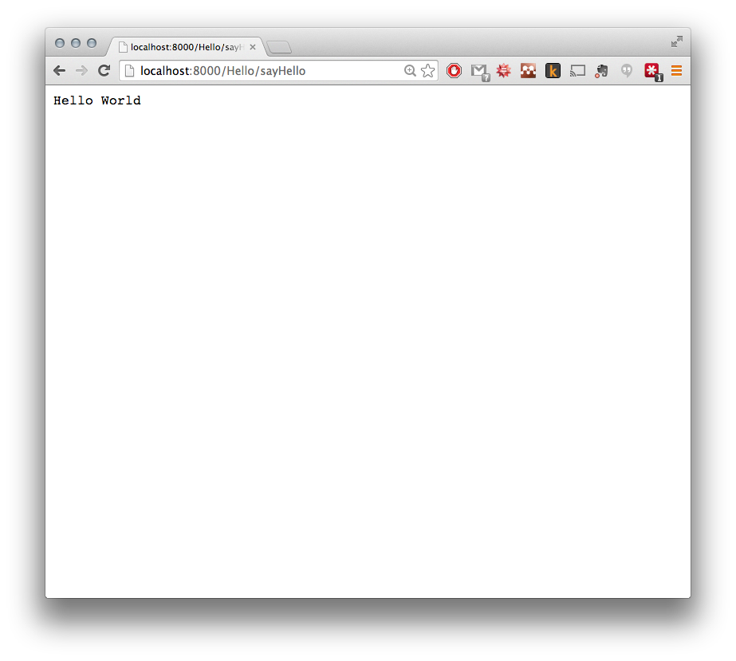

Getting Started with Spekl
========================================

.. _DRY: http://en.wikipedia.org/wiki/Don't_repeat_yourself
.. _scaffolding: http://en.wikipedia.org/wiki/Scaffold_(programming)
.. _convention_over_configuration: http://en.wikipedia.org/wiki/Convention_over_configuration
__ convention_over_configuration_

How can we know that our software does what it is supposed to do?
Techniques like unit testing are good for increasing our confidence
that a program does what it is supposed to do, but ultimately they are
weak approximations. Often times it's impossible to encode all the
possible edge cases into a unit test, and if it is possible, it may be
extremely time consuming to do so. 

What do we do? Enter Formal Methods.

Formal Methods is an area of Computer Science that aims to address the problem of
verifying what software does by using mathematical models and
techniques. It's also a term that strikes fear into the hearts of
productive engineers everywhere. 

Most Formal Methods techniques involve specifications, static
checkers, runtime assertion checkers, and SMT-solvers. However,
getting them to work together is often difficult and
error-prone. Spekl is a platform for streamlining the process of
authoring, installing, and using specifications and formal methods
tools.

Installation 
========================

Installing Spekl is easy. To install, simply download the installer
for your platform from Spekl's releases `releases page
<https://github.com/jsinglet/spekl-package-manager/releases>`_ and run
it. 

At the moment, users on Linux and OSX are required to have the Git
binaries installed on your path. This requirement will be lifted in
future versions of Spekl. Windows users don't need to have Git
installed. 

Your First Verification Project
===============================

In this section we're going to see just how easy it is to verify your
programs using Spekl. Spekl supports lots of different tools like
OpenJML, SAW, and FindBugs. In this section we are going to perform
extended static checking on a small application to show you how easy
Spekl makes the verification process.

To start, create a new directory you want to store this example in::

  ~ » mkdir my-project
  ~ » cd my-project

Next, initialize the project in that directory. You can do this with
the ``spm init`` command. This command is interactive but for this
example we are going to just accept the defaults ``spm init`` uses.

.. code-block:: yaml
		
  ~ » spm init
  [spm] INFO  - [command-init]
  [spm] INFO  - [new-project] Creating new verification project...
  Project Name? [default: my project]
  Project Id? [default: my.project]
  Project Version? [default: 0.0.1]
  #
  # Basic Project Information
  #
  name            : my project
  project-id      : my.project
  version         : 0.0.1
  
  #
  # Checks
  #
  # hint: Use spm add <your-tool> to add new checks here
  #
  
  ##
  ## Example
  ##
  # checks :
  #   - name        : openjml-esc
  #     description : "OpenJML All File ESC"
  #     language    : java              # might not need this, because it is implied by the tool
  #     paths       : [MaybeAdd.java]
  
  #     tool:
  #       name      : openjml-esc
  #       version   : 0.0.3
  #       pre_check :  # stuff to do before a check
  #       post_check:  # stuff to do before a check
  
  #     # specs:
  #     #   - name: java-core
  #     #     version: 1.1.1
  
  
  Does this configuration look reasonable? [Y/n] y
  [spm] INFO  - [new-project] Writing project file to spekl.yml
  [spm] INFO  - [new-project] Done.

This command creates a file called ``spekl.yml`` in the directory you
execute ``spm init`` in. Edit that file to look like the listing,
below.

.. code-block:: yaml
  
  #
  # Basic Project Information
  #
  name            : my project
  project-id      : my.project
  version         : 0.0.1
  
  checks :                                                                                                 
    - name        : openjml-esc                                                                            
      description : "OpenJML All File ESC"                                                                 
      paths       : [MaybeAdd.java]                                                                        
                                                                                                           
      tool:                                                                                                
        name      : openjml-esc                                                                            
        pre_check :  # stuff to do before a check                                                          
        post_check:  # stuff to do before a check                                                          
  
What did we do in the listing, above? In the checks section we defined
a check called ``openjml-esc``. This is the extended static checker
provided by OpenJML, a tool that is able to check programs written in
the `JML Specification Language
<http://www.eecs.ucf.edu/~leavens/JML//index.shtml>`_. You don't need
to know JML to follow this example, but JML is an excellent modeling
language that is widely known (meaning, you should probably learn
it). 

Continuing with the example above, we defined just one check
here. Note that we have specified that we want to use OpenJML
declaratively --- we haven't specified *how* to use OpenJML. Also note
that OpenJML depends on things like SMT solvers which may be
difficult for new users to configure. We haven't needed to specify
anything about them, either.

Note that in the ``paths`` element we specified that we want to check
the file ``MaybeAdd.java``. We'll create this file next. Note that the
``paths`` element can contain a comma-separated list of paths that may
contain wildcards. You use this to specify the files you want to run a
given check on.

Next, put the following text into the file ``MaybeAdd.java`` in the
current directory

.. code-block:: java

  public class MaybeAdd {

    //@ requires 0 < a && a < Integer.MAX_VALUE/2;
    //@ requires 0 < b && b < Integer.MAX_VALUE/2;
    //@ ensures  0 < \result;
    public static int add(int a, int b){
	return a-b;
    }

    
    public static void main(String args[]){

	System.out.println(MaybeAdd.add(1,2));

    }

  }

In this minimal class you can see that we wrote a minimal example that
(wrongly) adds two integers. Let's see what happens when we run this
example with Spekl. To do that, first let's tell Spekl to install our tools::

  ~ » spm install

This command will kick off an installation process that will install
``z3``, ``openjml``, and ``openjml-esc``. 

After that completes, we can run a check with the following command::

  ~ » spm check

The Verily installer comes with everything you need to start writing
applications in Verily right away. To start, download the latest
installer from the   `releases page <https://github.com/jsinglet/Verily/releases>`_. Verily requires that you have a Java version 1.7+ and a recent version of Maven 3. 

On Windows platforms, you can install Verily simply by running the downloaded JAR file. On other platforms (Linux and Mac) you will have to start the Verily installer via the command line as follows::

~ » sudo java -jar verily-<release>.jar

Where ``release`` is the release version of Verily that you downloaded, above.

Once Verily is installed, you can interact with it in a number of ways. The first (and perhaps most simple) is to interact with Verily on the command line. After installing Verily, the ``verily`` executable will be available on your system's ``PATH``. The command options of Verily are summed up in the listing below::

  ~ » verily -help                                                                                                               
  usage: verily
   -contracts           enable checking of contracts
   -d                   run this application in the background
   -fast                do not recalculate dependencies before running
   -help                display this help
   -init <dir>          create a new Verily application in the specified
			directory
   -jml <path-to-jml>   the path to the OpenJML installation directory.
   -n <threads>         the number of threads to create for handling
			requests.
   -new <newclass>      create a new Verily Method+Router pair
   -nocompile           do not do internal recompile (used for development
			only)
   -nostatic            disables extended static checking
   -port <portnumber>   port number to bind to (default 8000)
   -run                 run the application
   -test                run the unit tests for this application
   -w                   try to dynamically reload classes and templates (not
			for production use)
   -z3 <path-to-z3>     the path to the Z3 installation directory.

While an IDE is not strictly necessary to work with Verily, if you are an IntelliJ user, you can use our simple VerilyIdea Plugin for IntelliJ. You can also get the plugin from the [main page](/). 

Hello World in Verily
=====================

In this section we are going to construct the most minimal version of a Verily application possible: the so-called "Hello World" application. To begin, make sure you have already installed Verily and run the following command on the command prompt from the directory in which you'd like to create your project::

  ~/Projects » verily -init HelloWorld                                                                                           
  [INFO] Creating directory hierarchy...
  [INFO] Done.
  [INFO] Initializing Maven POM...
  [INFO] Done. Execute "verily -run" from inside your new project directory to run this project.

After this command completes, you will have a new directory called ``HelloWorld`` in your current working directory. 

Next, change to the newly-created directory and create a new Verily Method with the ``-new`` command::

  ~/Projects » cd HelloWorld 
  ~/Projects/HelloWorld » verily -new Hello                                                                                      
  [INFO] Creating a new Method/Router pair...
  [INFO] Method/Router Pair Created. You can find the files created in the following locations:
  [INFO] M: src/main/java/methods/Hello.java
  [INFO] R: src/main/java/routers/Hello.java
  [INFO] T: src/test/java/HelloTest.java

Note that in addition to a Verily Method, a corresponding router and unit test is also created for you. We'll get to that in a moment. 

Writing Your Method
-------------------

After creating your new method/router pair, you should see the following in the ``src/main/java/methods/Hello.java`` file:

.. code-block:: java
  
  package methods;

  import verily.lang.*;

  public class Hello {

       public static final void myFunction(ReadableValue<String> message){
	    // TODO - Write your application
       }
  }
 
This class corresponds to a Verily method class. There are several ways to make our example say "Hello World," and as you learn more about Verily you will find other methods, but for the moment we will do this by transforming the class in the following way:

.. code-block:: java

  package methods;

  import verily.lang.*;

  public class Hello {

       public static final String sayHello(){
		return "Hello World";
       }
  }

The thing to note here is the return type of the method ``sayHello``. You'll notice that it's a return type of type ``String``. This value will then be passed as a formal parameter to your router.

Writing Your Router
-------------------

To write the corresponding router you will want to replace the generated router in your ``src/main/java/routers/Hello.java`` with the code in the following listing:

.. code-block:: java
  
  package routers;

  import verily.lang.*;

  public class Hello {

      public static final Content sayHello(String result) {
	       return new TextContent(result);
      }

  }

In the router, above, we have created the sayHello function. After the method class (``methods.Hello.sayHello``) executes, control will be passed to the ``routers.Hello.sayHello`` function. Note that the actual parameter value of the router method will be the return value of the ``methods.Hello.sayHello``.

The control flow of a Verily application looks like the application flow given in the following diagram. 

Running Your Application
------------------------

Once you have at least one method/router pair set up, you are ready to run your web application. To do this, use the ``-run`` option of Verily. The output below has been somewhat elided in order to highlight some of the important startup messages Verily will create::

  ~/Projects/HelloWorld » verily -run
  [INFO] Scanning for projects...
  [INFO] Bootstrapping Verily on port 8000...
  [INFO] Constructed new Verily container @ Sun Jun 08 11:44:24 EDT 2014
  [INFO] Created new thread pool with [10] threads.
  [INFO] Starting Verily container...
  [INFO] The Following MRR Endpoints Are Available in Your Application:
  [INFO] +----------------------+---------+-----------------+
  [INFO] | ENDPOINT             | METHOD SPEC | VERBS           |
  [INFO] +----------------------+---------+-----------------+
  [INFO] | /Hello/sayHello      | ()      | [POST, GET]     |
  [INFO] +----------------------+---------+-----------------+
  [INFO] [verily] Reloading project...
  [INFO] Starting services...
  [INFO] ------------------------------------------------------------------------
  [INFO] Verily STARTUP COMPLETE
  [INFO] ------------------------------------------------------------------------
  [INFO] Bootstrapping complete in 4.134 seconds. Verily ready to serve requests at http://localhost:8000/

Perhaps the most conceptually most important aspect of the above output is the MRR table, which has been excerpted, below::

  [INFO] The Following MRR Endpoints Are Available in Your Application:
  [INFO] +----------------------+-------------+-------------+
  [INFO] | ENDPOINT             | METHOD SPEC | VERBS       |
  [INFO] +----------------------+-------------+-------------+
  [INFO] | /Hello/sayHello      | ()          | [POST, GET] |
  [INFO] +----------------------+-------------+-------------+

The table printed above gives us several pieces of information about our small application:

* First, we know that there is exactly one application endpoint available. 
* The endpoint that is available maps to our ``sayHello`` method at the URL ``/Hello/sayHello``.
* The ``sayHello`` method has no formal parameters, thus we should not expect to supply any in the request URI. 
* The ``sayHello`` method is available for either ``POST`` or ``GET`` requests. 

To execute this method, point your web browser at: ``http://localhost:8000/Hello/sayHello``. Your web browser should render something similar to the figure, below:

Next Steps
==========

In this quick start we've only just scratched the surface of Verily. If you'd like to start using the more advanced facilities of Verily to be more reliable web applications, please take a look at the rest of the documentation.
